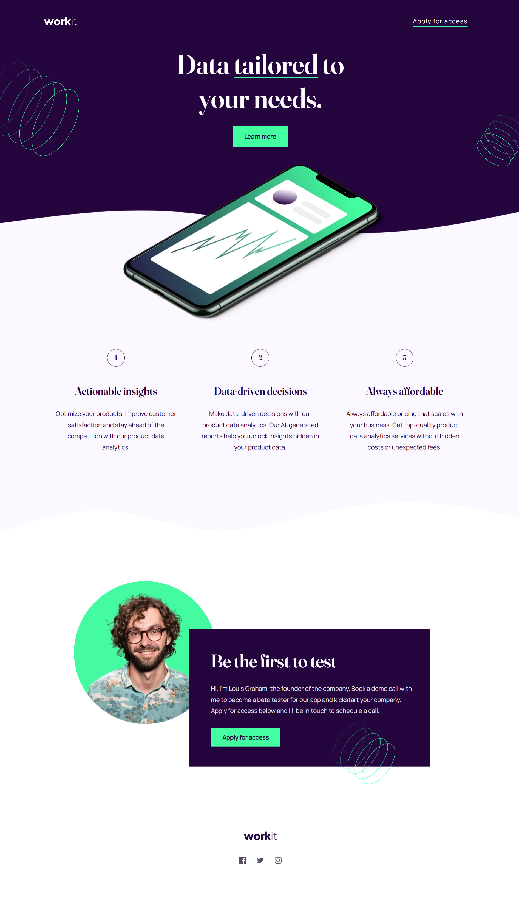
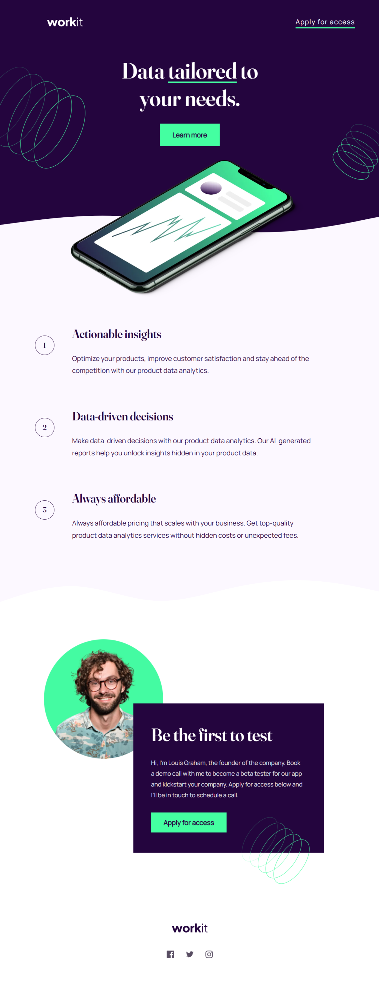
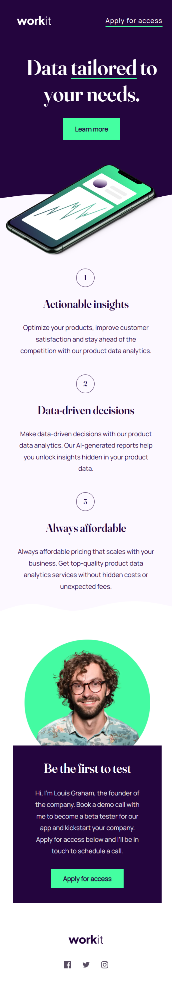

# Frontend Mentor - Workit Landing Page

## Welcome! 👋

## Overview:
The Workit landing page is a responsive web design project developed as part of the Frontend Mentor challenge. This project showcases a visually appealing landing page that effectively communicates the value of data analytics tailored to user needs.

## Features:
- Responsive Design: The layout is designed to adapt seamlessly to different screen sizes, ensuring a user-friendly experience across devices.
- Stylish Navigation: The navigation bar includes a logo and an "Apply for access" button, allowing users to easily navigate the page.
- Hero Section: Features a prominent headline and call-to-action button, combined with visually appealing background images that enhance the overall aesthetic.
- Informative List: Highlights three key benefits of the service offered, each with a unique number and description to draw attention to actionable insights.
- Founder Introduction: Includes a section for the founder, providing a personal touch and inviting users to book a demo call.
- Social Media Integration: The footer contains links to social media platforms, encouraging users to connect and engage.

## Technologies Used:
- HTML: Structured the content using semantic HTML elements.
- CSS: Styled the page using CSS for layout, typography, and responsiveness, utilizing custom fonts and transitions for a polished look.
- SVG Images: Incorporated SVG files for crisp graphics and backgrounds, ensuring high quality at any resolution.

## Folder Structure:
- assets/fonts: Contains custom font files for the project.
- assets/images: Stores all images used, including logos and background patterns.
- styles.css: The main stylesheet controlling the visual layout and design.
- index.html: The main HTML document of the landing page.

## Screenshots:

### Desktop View:

### Tablet View:

### Mobile View:

## Conclusion:
The Workit landing page project serves as an excellent example of how to create a modern, responsive web page that effectively communicates a brand's message. Feel free to explore the project and suggest any improvements or changes!